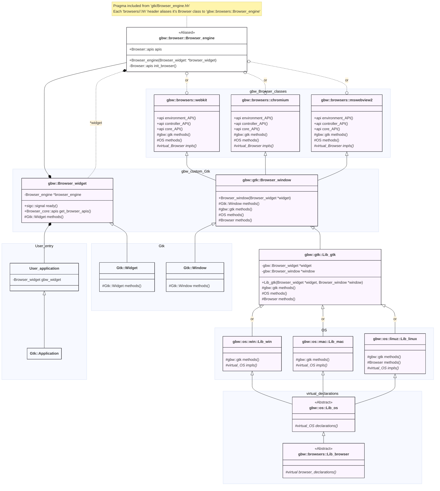

[Home](../../#development) 
[Development notes](..)

# Gtk
This folder is for integrations and presentation of the browser engine window into a `Gtk::Window`

## Browser_window.hh
Provides the top level `Gtk::Window` instance that will wrap the native browser engine window.

## Browser_engine.hh
Header file that uses pragma guards to include the relevant browser engine class header. The included browser header file MUST alias it's class to `gbw::browser::Browser_engine`

## Class Hierarchy

## `Gtk::Window`, `Gtk::Widget` and embedding
Gtk >= 4 no longer supports embedding native windows within native windows. This leaves two options for embedding a browser engine window:
1) Use Off Screen Rendering (OSR) from the browser engine, render the pixel buffer into a `Gtk::Widget` and map Gtk signals back to the browser.
2) Wrap the native browser window in a new top level `Gtk::Window` and map it's size and position back to a placeholder widget. This approach I am calling pseudo-embedding.

Considering that:
- not all browser engines support OSR, 
- signal mapping can be fragile and difficult to maintain across multiple engines,
- thread-safety is not inherent to GTK but required in some engines,

it has been decided to go with the pseudo-embedding approach for GBW.
